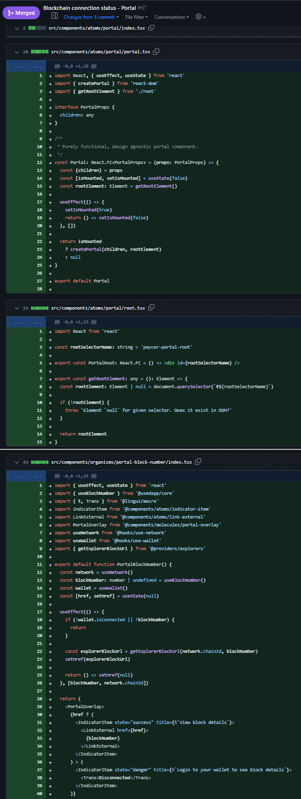
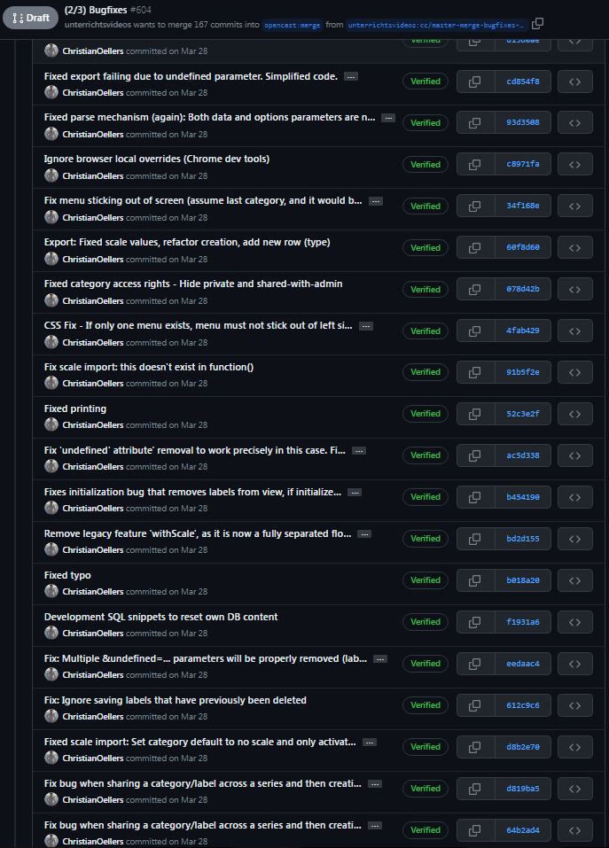

# Let's work together!

Things you might find insightful.

 

**TOC**

- [Q+A](#q+a)
- [Work quality](#work-quality)

 

---

 

## Q+A

Please refer to the [FAQ section](https://www.codeconut.io/faq) of my company, which describes it in greater detail.
You'll find answers about clients I take, team and workflow experience and work ethics and philosophies.

 

---

 

## Work quality

The difference between personal and commercial works:

Most projects you'll find here are my own, without community contributors or commercial purposes.
This is not intended, and all is done in unpaid spare time. I decided to sacrifice some quality standards for the benefit of faster workflows
and focusing on getting things done _(especially regarding commits, branching, PRs, linting/formatting)_. Some projects have been done many years ago,
and while I might keep updating them, it's unlikely they'll receive a full refactoring from scratch.

When assigned to a team or working in a commercial setting, the level of quality and attention spend on these standards and workflows is much higher.
For instance, I'd pay attention to proper branching, ticket systems and squash/rebase workflows. Review my public client references [README](README.md).

Thank you for your understanding :)

### Proof

Examples of high quality results in commercial settings:

  
Source code

  

  
Commit messages

  

