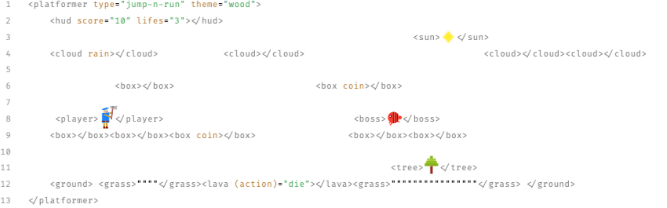

# Hi, I'm Christian

I work as Full-Stack Developer for my own company [Codeconut Ltd.](https://codeconut.io) founded 2019 in Cyprus ☀️

✨ &nbsp;Codeconut builds modern web applications with Angular, React and WordPress for startups and small scale companies. Alongside I'm available for freelancing and remote engagement.

✨ &nbsp;In my spare time, I challenge myself with building 2D game tools and magically misuse modern technologies in probably unintended ways.

  

## Projects

| GitHub profile | Content |
|----------------|---------|
| [Christian Oellers](https://github.com/ChristianOellers) | Technology experiments, Game development |
| [Codeconut Ltd.](https://github.com/Codeconut-Ltd) | Business projects, Collaborative OpenSource |
| [TheRemoteCoder](https://github.com/TheRemoteCoder) | Technology archive – Not maintained |
| [Gists](https://gist.github.com/ChristianOellers) | Code snippets |

## Profiles

| Link | Content |
|------|---------|
| [Blog](https://www.theremotecoder.com) | Tech talk and nerdery |
| [CodePen](https://codepen.io/TheRemoteCoder) | Live demos |

  

## Tech I work with

  

## Get in touch

  

