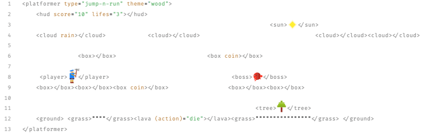

# Hi, I'm Christian

Full-Stack Developer at Codeconut Ltd., founded 2019 in sunny Cyprus. 🇨🇾

 

---

## Tech stack

Main expertise and side projects:

 

---

## Contact

Let's get in touch and talk about your next project!

